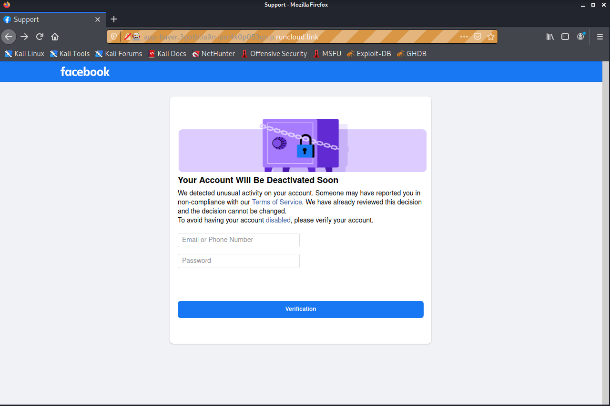
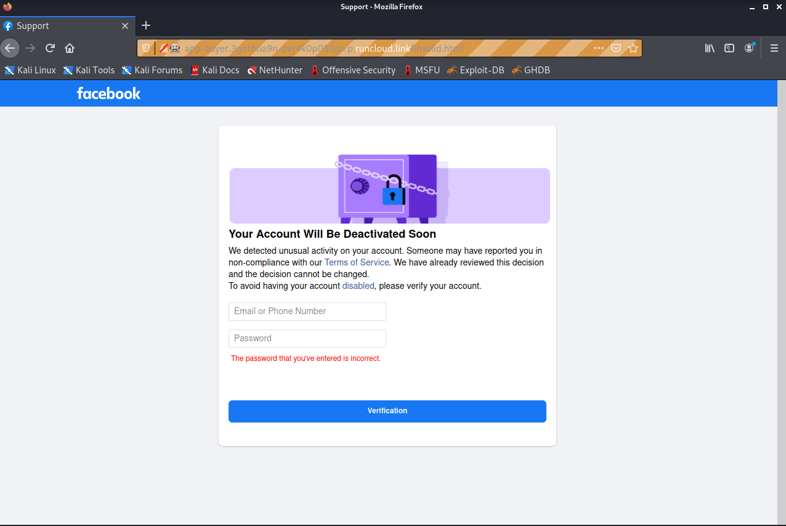
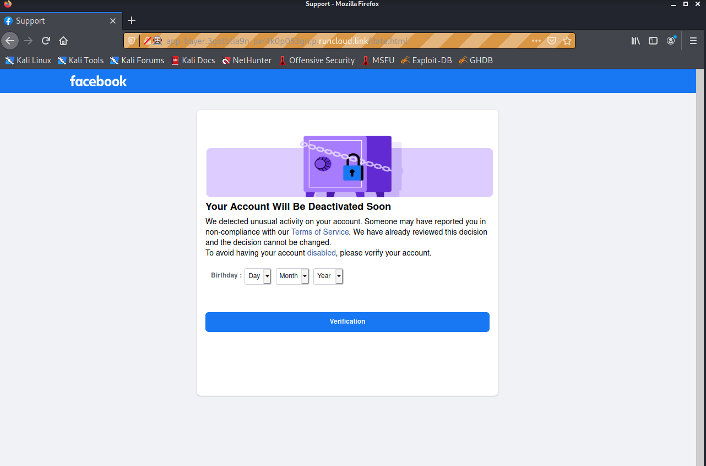

# Phishing - app-bayer.3gotbtia9n-pxr4k0p053gn.p.runcloud.link

## Introduction
Phishing site disgusing itself as Facebook. Attempts to get user's email, password, birthdate. Basic checks for inputs that seem illegitamate.

<br/><br/><br/>

## The scam
<br/>

First, it asks for your email and password. Users may be tempted to do this since the site claims their account is going to be disabled.

In the source code, there are some interesting snippets of JS. Below are the (cleaned up) snippets.

```js
function mousedwn(e) {
    try {
        if(event.button == 2 || event.button == 3) return false
    } catch (e) {
        if(e.which == 3) return false
    }
}
document.oncontextmenu = function() {
    return false
};
document.ondragstart = function() {
    return false
};
document.onmousedown = mousedwn
```

Basically, the above snippet disables middle-click and right-click. There might be an error with the mousedwn function.

```js
window.addEventListener("keydown", function(e) {
    if(e.ctrlKey && (e.which == 65 || e.which == 66 || e.which == 67 || e.which == 73 || e.which == 80 || e.which == 83 || e.which == 85 || e.which == 86)) {
        e.preventDefault()
    }
});
document.keypress = function(e) {
    if(e.ctrlKey && (e.which == 65 || e.which == 66 || e.which == 67 || e.which == 73 || e.which == 80 || e.which == 83 || e.which == 85 || e.which == 86)) {}
    return false
}
```

The above snippet prevents the user from using Ctrl + [A, B, C, I, P, S, U, V]

```js
document.onkeydown = function(e) {
    e = e || window.event;
    if(e.keyCode == 123 || e.keyCode == 18) {
        return false
    }
}
```

The above snippet prevents the user from using F12 and the Alt key


Upon clicking "Verification", the form sends a POST request to the endpoint `accept.php`.

The fields for the request are as follows:

```
masuk=USERNAME&keluar=PASSWORD&submit=Verification
```

It seems that the keys are in Malay.

Regardless of the information entered, the user will be redirected to `invalid.html`, claiming that the password is incorrect.

<br/>

The page has the same JS as the previous, disabling the same keys/key combo.

This process of getting the user's email and password again is most likely done so the scammers can compare the input from the two times the users provide their info, to weed out potential spammers.

After submitting to the endpoint `accept1.php` with the same fields, the user is redirected to `date.html`


<br/>

This asks for the user's birthdate, with the same restrictions implemented with JS.

Data is then POSTed to `accept2.php` with the fields `dd=DAY&mm=MONTH&yy=YEAR&submit=Verification`

After which, the user is redirected to the actual Facebook login page.

## Notes
Assets used seems to be ripped off directly from Facebook.

Redirecting is done not by the server side with a 302 response, but rather JS in the response, using `window.location = "website_url"`