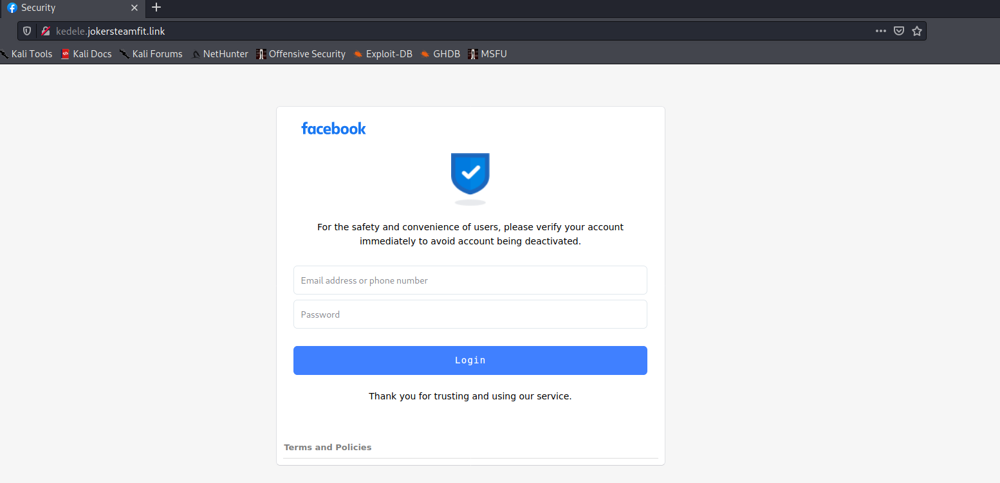

# Phishing - kedele.jokersteamfit.link

## Introduction
kedele.jokersteamfit.link is a phishing site, disguising itself as Facebook. The link bears no resemblance to any known Faceebook domains, and most likely relies on victims who neglect to check the domain name. It seeks to gather the victim's Email, Password, Name and Date of Birth.

   

## Login
Below is  ascreencapture of the phishing login page. It claims that the victim's account is going to be deactivated unless they sign in.

 

Victims input their Email and Password.

These are then POSTed to `/` and victims are redirected to `/biday.php`

## Name and DoB
The victims are then prompted to "verify" their accounts by inputting their name and date of birth.

These are POSTed to `/biday.php`, with the params `passdua=********&tanggal=*&bulan=***&tahun=****`

These Indonesian terms hint the creators of this phishing site are located there